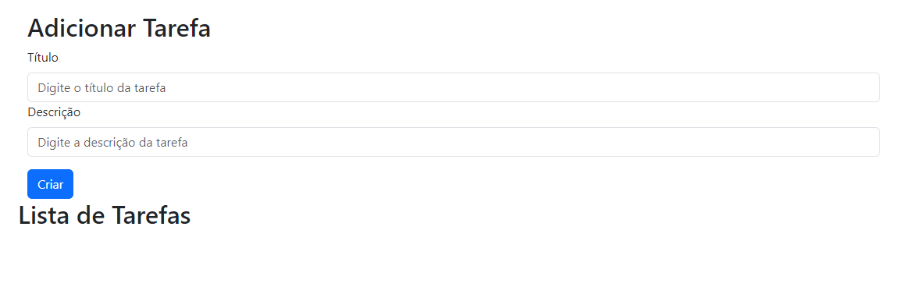
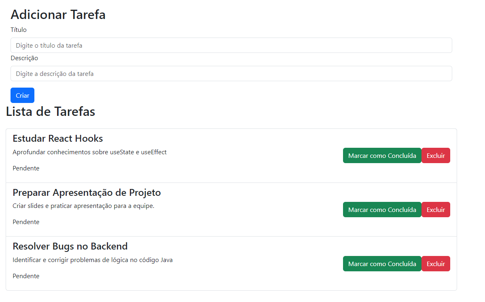
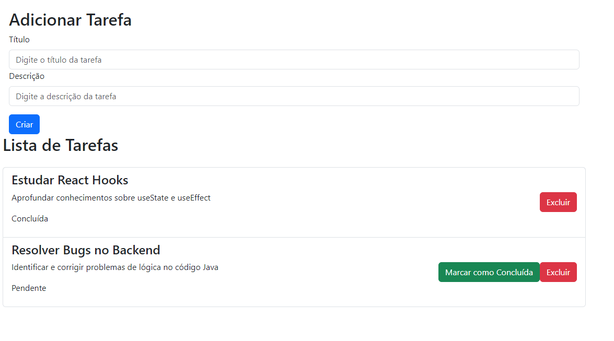

# Sistema de Gerenciamento de Tarefas

Um simples sistema de gerenciamento de tarefas desenvolvido com React e Spring Boot.

## Tecnologias Utilizadas

- Frontend:
  - React
  - React Bootstrap

- Backend:
  - Spring Boot
  - Spring Data JPA
  - H2 Database (em memória)

- Comunicação:
  - Axios (para integração frontend-backend)

## Como Instalar

1. Clone o repositório: 
  - git clone https://github.com/warleyramires/gerenciadorTarefas.git
  - cd gerenciadorTarefas

2. Instale as dependências do frontend e do backend:
  - cd gerenciador-tarefas
  - npm install
  - cd ../tarefas
  - mvn install

## Como Usar

1. Inicie o servidor backend (Spring Boot)   
2. Inicie o frontend (React)
3. Abra o navegador e acesse: http://localhost:3000

## Capturas de Tela

